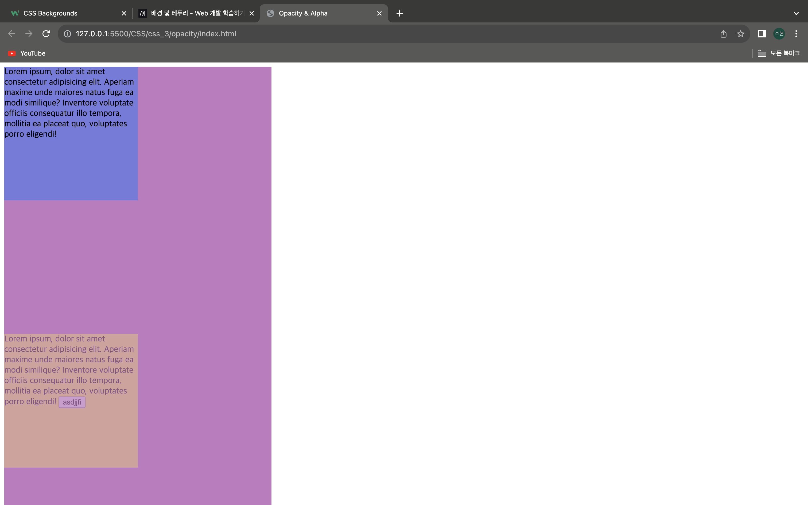

# Opacity
결과화면<br>


- html
```html
<!DOCTYPE html>
<html lang="en">
<head>
    <meta charset="UTF-8">
    <meta name="viewport" content="width=device-width, initial-scale=1.0">
    <title>Opacity & Alpha</title>
    <link rel="stylesheet" href="app.css">
</head>
<body>
    <section>
        <div id="rgba">
            Lorem ipsum, dolor sit amet consectetur adipisicing elit. Aperiam maxime unde maiores natus fuga ea modi similique? Inventore voluptate officiis consequatur illo tempora, mollitia ea placeat quo, voluptates porro eligendi!
        </div>
    </section>

    <section>
        <div id="opacity">
            Lorem ipsum, dolor sit amet consectetur adipisicing elit. Aperiam maxime unde maiores natus fuga ea modi similique? Inventore voluptate officiis consequatur illo tempora, mollitia ea placeat quo, voluptates porro eligendi!
            <button>asdjjfi</button>
        </div>
    </section>
</body>
</html>
```

- css
```css
section{
    width: 500px;
    height: 500px;
    background-color: rgb(193, 122, 193);
}

#rgba{
    width: 50%;
    height: 50%;
    /* a(0~1): background에 적용 */
    background-color: rgba(75, 123, 236, 0.671);
}

#opacity{
    width: 50%;
    height: 50%;
    background-color: yellow;
    /* opacity : 전체 요소에 적용 */
    opacity: 0.3;
}
```